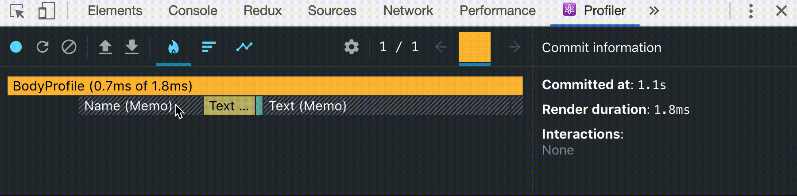

🏁시작하기 전에
- **메모이제이션**이란 계산된 값을 자료구조에 저장하고 이후 같은 **계산을 반복하지 않고 자료구조에서 꺼내 재사용하는 것**을 말한다. 메모이제이션의 대표적인 예로는 [동적계획법](../../algorithm/다이나믹프로그래밍/)의 탑다운 방식이 있다.

<br>

⏳tl;dr
- `useMemo`와 `useCallback`는 메모이제이션 기능을 지원하는 리액트의 내장 훅으로, **퍼포먼스 최적화**를 위하여 사용된다.
- `useMemo`는 메모이제이션된 값을 반환한다.
- `useCallback`은 메모이제이션된 콜백을 반환한다.

<br>

리액트는 상태의 변경에 따라 적절한 컴포넌트만 효율적으로 갱신하고 렌더링된다고 소개하지만, 실제로는 상태가 변경되는 컴포넌트와 그 이하의 모든 자식 컴포넌트가 랜더링의 대상이 된다. 문제는 자식 컴포넌트의 상태가 변경되지 않아도(갱신될 필요가 없어도) 불필요한 랜더링이 일어난다는 것이다.

<br>

리액트는 퍼포먼스 최적화를 위해 여러 API를 제공하고 있으며, 이 API들을 적절히 사용하면 불필요한 렌더링을 줄이고, 원래 리액트의 소개처럼 효율적인 렌더링이 가능하게 할 수 있다.
이 글에서는 메모이제이션 기능을 지원해 퍼포먼스 최적화에 사용되는 리액트 내장 훅의 사용법을 소개한다.

<br>

### React DevTools
**리액트 개발자 도구 > Profiler 탭**의 **Start Profiling**기능(녹화 버튼)을 사용하면 컴포넌트의 랜더링을 분석할 수 있다.

<br>




<hr>


### 예제 코드 

이 글에서는 아래 코드가 계속 사용될 것이다.

```js
// Text.jsx
const Text = ({title, value}) => <div>{title}:{value}</div>;
// Button.jsx
const Button = ({ handleClick, children }) => <button onClick={handleClick}>{children}</button>;
// Name.jsx
const Name = () => <div>홍길동</div>;

// BodyProfile.jsx
const BodyProfile = () => {
  const [weight, setWeight] = useState(0);
  const incrementWeight = () => setWeight(weight + 1);

  const [height, setHeight] = useState(0);
  const incrementHeight = () => setHeight(height + 1);

  return(
    <>
      <Name/>
      <Text title="weight" value={weight}/>
      <Button handleClick={incrementWeight}>몸무게 증가</Button>
      <Text title="height" value={height}/>
      <Button handleClick={incrementHeight}>키 증가</Button>
    </>
  );
}
```

<br>

### React.memo로 시작하기

`React.memo`를 적용한 컴포넌트는 해당 컴포넌트가 의존하고 있는 `props`나 `state`의 변화가 생길때만 랜더링이 일어난다. 현재의 예제 코드에서는 버튼을 누르면 상태가 변경되지 않는 **Name**컴포넌트나 변경된 상태값을 의존하지 않는 컴포넌트까지도 랜더링이 일어나고 있다.


```js
// Name.jsx
export default React.memo(Name);
// Text.jsx
export default React.memo(Text);
// Button.jsx
export default React.memo(Button);
```

`React.memo`를 적용하고 나면 의존하는 상태 존재하지 않는 **Name**컴포넌트에서 더 이상 불필요한 랜더링이 일어나지 않는다.

하지만 **Button**컴포넌트는 여전히 자신과 관계없는 상태의 변경에도 랜더링이 일어난다. 그 이유는 **Button**컴포넌트에 `props`로 전달되는 `handleClick`함수 때문이다.

<br>

### {}와 {}는 같지 않다.

함수형 컴포넌트에서 상태값이 변경되면 랜더링이 일어나고 컴포넌트내의 함수들도 다시 생성된다. 예제코드에서는 `incrementWeight`와 `incrementHeight`함수가 랜더링할때 마다 다시 생성되고, 자식 컴포넌트로 전달된다. 함수는 객체이기 때문에 렌더링 이전과 이후의 메모리 주소가 달라 자식 컴포넌트에서 `React.memo`기능을 사용해도 랜더링을 막을 수 없다. 이런 경우 `useCallback`훅을 사용하면 랜더링을 최적화 할 수 있다.

<br>

### useCallback

`useCallback`은 랜더링 성능 최적화를 위해 제공되는 훅이다. 훅은 전달된 콜백 함수를 메모이제이션하여 반환하고, 이 함수는 오직 의존하는 상태값이 변경된 경우에만 갱신된다. 아래 코드에서 `incrementWeight`와 `incrementHeight`함수는 각각 `height`,`weight`상태값이 변경된 경우에만 다시 생성된다. 

```js
const incrementHeight = useCallback(() => {
  setHeight(height + 1);
}, [height]);

const incrementWeight = useCallback(() => {
  setWeight(weight + 1);
}, [weight]);
```

`useCallback`은 `useEffect`와 마찬가지로 두번째 인자로 빈배열(`[]`)을 넣으면 어떤 상태값에도 반응하지 않으며, 두번째 인자로 아무것도 넣지 않으면 모든 상태 변화에 반응한다.

-----


### 예제코드

이전 예제 코드에서 **BodyProfile**컴포넌트를 다음과 같이 수정했다. `expensiveTask()` 함수는 `weight`값을 넘겨주기 직전에 반드시 실행되어야 하는 함수라고 가정하자. 

```js
// BodyProfile.jsx
const BodyProfile = () => {
  const [weight, setWeight] = useState(0);
  const incrementWeight = useCallback(() => {
    setWeight(weight + 1);
  }, [weight]);

  const [height, setHeight] = useState(0);
  const incrementHeight = useCallback(() => {
    setHeight(height + 1);
  }, [height]);

// highlight-start
  const expensiveTask = () => {
    let i = 0;
    while(i < 999999999) i++;
    return weight > 1000;
  }
// highlight-end

  return(
    <>
      {/* 몸무게를 묻는건 아주 어려운 일이기 때문에 */}
      <Text title="weight" value={expensiveTask() ? '1톤' : weight}/> 
      <Button handleClick={incrementWeight}>몸무게 증가</Button>
      <Text title="height" value={height}/>
      <Button handleClick={incrementHeight}>키 증가</Button>
    </>
  );
}
```

[몸무게 증가] 버튼을 눌러 `weight`값이 변경되면, **Text**컴포넌트를 갱신할때에 `expensiveTask()`함수로 인하여 몇 초간 렌더링 지연이 생기게 하였다.

문제는 `weight`상태와 관계 없는 [키 증가] 버튼을 누를때에도 딜레이가 생긴다는 것이다. 버튼을 눌러 상태가 변경되고 컴포넌트가 랜더링될때마다 `expensiveTask()`함수 역시 다시 실행되게 되기 때문이다. 렌더링을 지연시키는 함수가 상태 변경마다 매번 실행되는 것은 여러모로 좋지 않기 때문에, 리액트에 불필요한 상황에서는 실행될 필요가 없음을 알려야한다.

<br>

### useMemo

`useMemo`역시 퍼포먼스를 최적화 하기위한 훅이다. `useCallback`과의 차이점은 `useCallback`은 전달된 함수 그 자체를 캐싱하지만, `useMemo`는 전달된 함수가 실행되고 반환된 결과를 캐싱한다는 것이다.

```js
const memoizedValue = useMemo(() => computeExpensiveValue(a,b), [a,b]);
```

예제 코드에서 `expensiveTask()`는 `weigth`값의 변경에만 의존성을 갖기 때문에, 다른 상태 값의 변경에는 작동하지 않아야 한다. `useMemo`에 `expensiveTask()`함수를 넣으면 **함수의 반환값을 메모이제이션**하고, 두번째 인자 배열에 `weight`를 명시하면 `expensiveTask()`함수는 `weight`값의 변경될때에만 실행된다.


```js
const expensivetask = useMemo(() => {
  let i = 0;
  while(i < 10000000) i++;
  return weight > 1000;
}, [weight]);
```
이제 [키 증가]버튼을 눌러도 랜더링이 지연되지 않는다.

<br>

`useMemo`에 전달된 함수는 렌더링 중에 실행되기 때문에 랜더링과 관련된 작업을 전달하는것이 적절하다. 랜더링과 관계 없는 사이드 이펙드의 경우는 `useEffect`를 사용하는 것이 좋다.

<hr>

### 참고
- [Hooks API Reference](https://ko.reactjs.org/docs/hooks-reference.html#usememo)
