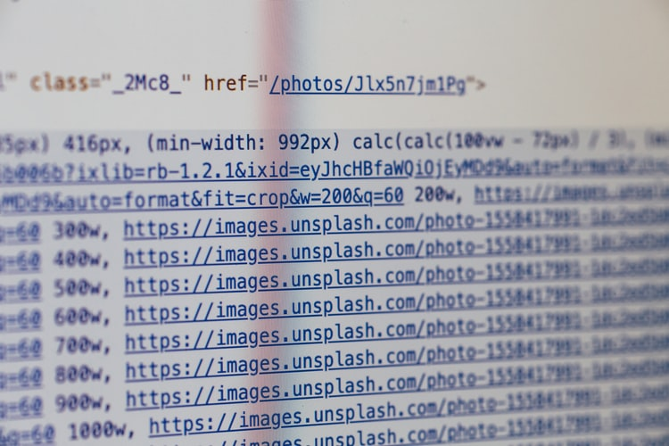
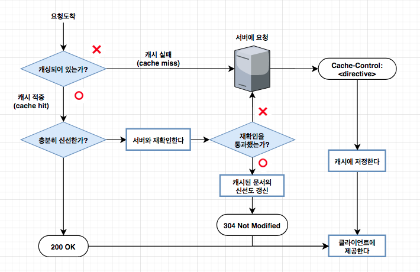
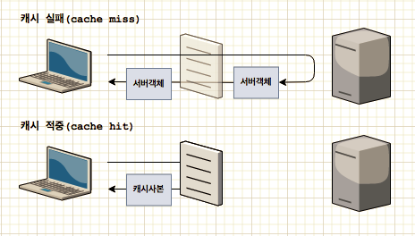
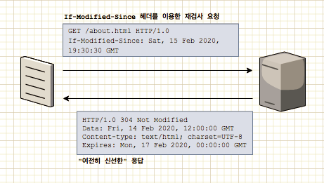

> Photo by Markus Spiske on Unsplash

캐시는 **자주 쓰이는 문서의 사본을 자동으로 보관하는 HTTP 장치**이다. 웹 요청이 캐시에 도착했을 때, 캐시된 사본이 존재한다면, 그 문서는 origin 서버가 아닌 캐시로부터 제공된다. 이를 통해 다음과 같은 이점을 가져온다.

- 불필요한 데이터 전송을 줄여 네트워킹 비용을 줄여준다.
- 거리로 인한 지연시간을 줄여 웹페이지를 빨리 불러올 수 있게 된다.
- 서버에 대한 요청을 줄여 서버의 부하를 줄인다.

 

### 캐시 처리 단계(Cache Processing Steps)

캐시는 기본적으로 다음과 같은 단계로 동작한다.

 

 

#### 요청 받기와 파싱 (Receiving & Parsing)
네트워크로 부터 도착한 요청 메시지를 읽는다. 메시지를 파싱하여 URL과 헤더들을 추출한다.

 

#### 캐시 검색(Lookup)

요청에 대응하는 로컬 복사본이 있는지 검사하고, 사본이 없다면 서버에서 데이터를 받아온다.(그리고 복사본을 로컬에 저장한다.) 사본이 있다면 다음 단계를 진행한다.

> 캐시된 객체는 얼마나 오랫동안 캐시에 머무르고 있었는지, 얼마나 자주 사용되었는지 등에 대한 메타데이터를 포함한다.

 

#### 신선도 검사(Freshness check)
캐시된 사본이 충분히 신선한지를 검사한다.

> 캐시된 사본이 신선도의 한계를 넘을 정도로 오래 되었다면, 신선하지 않은것으로 간주되며, 그 사본을 클라이언트에 제공하기 전에 변경사항 여부를 서버에 확인해야 한다.

 

#### 응답 생성(Response creation)

새로운 해더와 캐시된 본문으로 응답메시지를 만든다. 캐시는 클라이언트에 맞게 헤더를 수정해야 하는 책임이 있다. 예를 들어 클라이언트가 HTTP/1.1응답을 기대하는 상황에서 서버가 HTTP/1.0 응답을 반환했다면, 캐시는 이 헤더를 적절하게 번역해야 한다. 캐시는 또한 신선도 정보(`Cache-Control`, `Age`, `Expires` 등)를 삽입하며, 요청이 프락시 캐시를 거쳐갔음을 알려주기 위해 종종 `Via`헤더를 포함시킨다. 캐시가 Date헤더를 조정해서는 안된다. Date헤더는 그 객체가 원 서버에서 최초로 생겨난 일시를 표현하는 것이다.

 

#### 발송(Sending)

캐시는 네트워크를 통해 응답을 클라이언트에 돌려준다.

 

#### 로깅(Logging) - optional

로그파일에 트랜잭션에 대해 서술한 로그를 남긴다.

--------

### 캐시 적중(cache hit)과 실패(cache miss)

 

 

캐시에 요청이 도착했을 때, 그에 대응하는 사본이 있다면 이를 이용해 요청을 처리한다. 이를 **캐시 적중(cache hit)**이라고 부른다. 만약 대응하는 사본이 없다면 origin 서버로 요청이 전달되며, 이것을 **캐시 실패(cache miss)**라고 부른다. 캐시가 적중되면 지구 반대편에 존재하는 origin서버의 응답을 기다리지 않아도 된다.

> 만약 특정 사이트를 자주 방문한다면 그 사이트의 모든 문서를 캐싱하면 어떨까? 그 문서들은 최신화된 정보일까?

-------

### 재확인(Revalidations)

캐시는 말그대로 사이트의 문서(및 콘텐츠)를 복사하여 저장하는 것을 말한다. 그래서 **캐시가 적중되었다고 할지라도 origin 서버의 콘텐츠는 변경될 수 있기 때문**에 반드시 캐시에 담긴 사본이 여전히 최신인지 서버를 통해 확인해야한다. 캐시를 재확인하는 시점은 대부분 클라이언트가 캐시에 사본을 요청하였고, 그 **사본에 대한 확인 필요할 정도로 오래된 경우에 실시**한다. 효과적인 확인을 위해 HTTP는 서버로부터 전체 데이터 객체를 가져오지 않고도 콘텐츠가 여전히 신선한지 확인하기 위해 작은 재검사 요청을 보낸다. 다음은 요청이 서버에 도착하면 일어날 수 있는 세가지 상황이다. (신선도 검사에 대한 규칙은 별도의 문서로 정리할 예정)

 

#### 재확인 적중 (Revalidate hit)
만약 서버의 문서가 변경되지 않았다면, 서버는 클라이언트에 작은 `HTTP 304 Not Modified` 응답을 보낸다. 그 사본이 여전히 유효함을 알게된 캐시는 즉각 사본이 신선하다고 표시한 뒤 그 사본을 클라이언트에 제공한다.

 

> HTTP에서 캐시된 객체를 재확인하기 위해 가장 많이 쓰이는것은 `If-Modified-Since` 헤더이다. 서버에게 보내는 GET요청에 이 헤더를 추가하면 캐시된 시간 이후에 변경된 경우에만 사본을 보내달라는 의미가 된다. 

 

이는 origin 서버간의 확인 과정으로 인해 순수 캐시 적중보단 느리지만, 서버로부터 객체 데이터를 받아올 필요가 없기 때문에 캐시 실패보다는 빠르다.

 

#### 재확인 실패 (Revalidate miss)
만약 서버 객체가 캐시된 사본과 다르다면, 서버는 콘텐츠 전체와 함께 평범한 `200 OK` 응답을 클라이언트로 보낸다.

 

#### 객체 삭제 (Object deleted)
만약 요청한 콘텐츠가 서버에서 삭제되었다면, 서버는 `404 Not Found` 응답을 돌려보내며, 캐시는 저장된 사본을 삭제한다.

-----

### 참고
- HTTP 완벽가이드