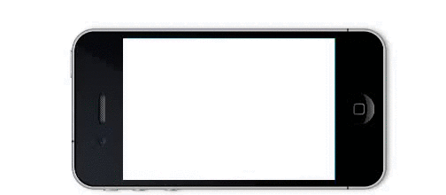

> (아무도 안쓰고 심지어 나도 안쓰는)나만의 라이브러리 만들어본 후기

### 계기

시작은 이러했다. 네이버 블로그에 들어가는 이미지 뷰어의 UI개발에 참여했는데, 뷰어 하단에 블로그 이미지들의 썸내일 리스트가 위치했다.
그런데 만약 1000개의 이미지가 블로그 포스트내에 존재한다면 1000개의 element를 만들어내야 하는가 하는 궁금증이들었다.
다수의 엘리먼트를 모바일 브라우저가 유지한다면 퍼포먼스 이슈가 있을것이기 때문이다.

당시 협업했던 개발자분께 이 질문을 드렸는데, 이 경우 돔스와핑(dom swapping) 방식의 무한 스크롤을 사용하게 될 것 같다는 답변을 들었고, 이 기술에 대해 굉장히 놀라웠던 기억이 있다.([jindo.m.InfiniteCard](http://jindo.dev.naver.com/docs/jindo-mobile/archive/1.14.0/doc/external/classes/jindo.m.InfiniteCard.html))
jindo를 사용해보지 않았지만 단순히 jquery의 아류라는 소문을 들었기 때문에 더더욱 놀랐었다.

 

(jindo에서 사용하는 무한스크롤 돔 스와핑(DOM Swapping) 방식)

 

얼마뒤 다른 프로젝트에서 무한스크롤을 사용하게 되면서 직접 만들어 보고싶어졌다.

### 다수의 리스트 아이템을 어떻게 처리했을까?

돔 스와핑과 유사하지만 조금 다른 방식을 사용했다. viewport에서 벗어난 리스트 아이템들을 지우고 캐싱하여 다시 그 엘리먼트를 보여줘야 할때 캐시된 아이템을 해당위치에 붙여주는 방식을 택했다.

### 그렇게 만들어진 무한스크롤

아이탬이 화면에 랜더되지 않으면 dom의 크기를 미리알수 있는 방법이 없다. 
api를 통해 동적으로 데이터를 랜더해준다.
아이템의 크기가 고정되어있다면 리플로우를 훨씬 줄일수 있다.

#### 단점
사용성이다. 무한스크롤의 아이템의 크기가 늘 같은 경우는 그리 많지 않다.

### 1차 개선

위의 문제점을 개선했다. 코드의 구조도 개선했다.
스크롤과 관련돤 코드와 데이터를 불러오는 코드를 분리했다.
물론 유동적인 크기의 아이템을 지원 하면서 퍼포먼스가 안좋아졌다.

### 2차 개선
만약 사용자가 항상 고정된 크기의 아이템을 랜더하고자 한다면, 이 스크롤은 이전보다 퇴보한것이다. 그래서 고정된 크기를 사용할때 이전 방식을 사용하도록 로직을 추가햇다. 무한스크롤이 적용되지 않은 스크롤을 무한스크롤로 전환하는 코드도 추가했다.

### 배포
퍼포먼스가 걱정된다면 사용하지 말라는 코멘트를 추가했다. 사실 아주 단순한 용도로 무한스크롤이 필요하다면, jquery로 만들어진 라이브러리들에 비해 퍼포먼스는 결코 떨어지지 않기 때문에 퍼포먼스 비교하는 

### 후기

추후 돔스와핑 방식을 사용해 보고 싶고, 링크로 이동한뒤 다시 스크롤로 돌아왔을때 해당위치를 기억하여 스크롤을 랜더해주고싶다.
아직도 개선할점이 많다.