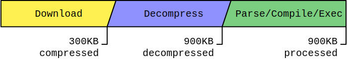
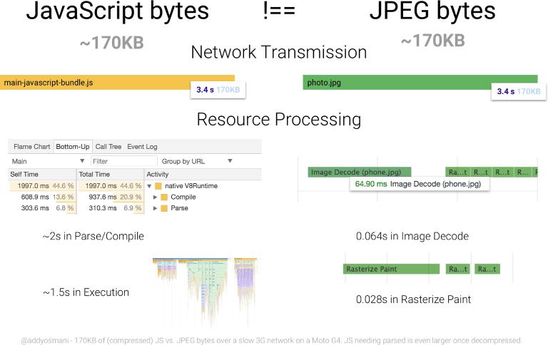

> [원본링크 : Web Fundamentals > Reduce JavaScript Payloads with Tree Shaking](https://developers.google.com/web/fundamentals/performance/optimizing-javascript/tree-shaking)

오늘날의 웹 애플리케이션은 꽤 커졌고, 특히 자바스크립트가 이렇게 되는데 한몫하고 있다. 2018년 중반부터, HTTP Archive는 [모바일 장치에서 JavaScript의 중간 전송 크기](https://httparchive.org/reports/state-of-javascript#bytesJs)를 대략 350KB로 설정했다. 그리고 이것은 전송될때의 크기일 뿐이다. 자바스크립트는 압축되어 네트워크를 통해 전송되는 편인데, 브라우저에서 압출을 푼 후 실제 자바스크립트의 코드량은 훨씬 많다는 것을 의미한다.

이것이 중요한 지적인 이유는 리소스를 처리하는 것과 압축은 무관한 일이기 때문이다. 압축을 해제시에 900KB라면 압축했을때 300KB가 될지라도, 파서와 컴파일러에겐 여전히 900KB의 자바스크립트일뿐이다. 

 

 
 
**Figure 1.** 자바스크립트를 다운받고 실행하는 과정이다. 주목할 부분은 스크립트의 전송크기가 300KB로 압축되어있지만, 구문분석, 컴파일 그리고 실행해야하는 자바스크립트의 크기는 900KB이다.

자바스크립트는 처리하는 비용이 비싼 리소스이다. 한 번 다운로드하면 비교적 간단한 디코딩 시간만 발생하는 이미지와 다르게, JavaScript는 구문 분석, 컴파일 및 최종 실행되어야 한다. 그래서 JavaScript는 바이트당 비용이 다른 리소스들에 비하여 더 비싸다.

 

 

**Figure 2.** 170KB의 자바스크립트를 파싱/컴파일링 하는 작업 비용 vs 같은 사이즈의 JPEG파일을 디코드하는 시간
([참조](https://medium.com/dev-channel/the-cost-of-javascript-84009f51e99e))

 

[JavaScript 엔진의 효율성 향상](https://blog.mozilla.org/javascript/2017/12/12/javascript-startup-bytecode-cache/)을 위해 [지속적으로 개선](https://v8.dev/blog/background-compilation)되고 있지만, JavaScript 성능 향상은 항상 개발자의 몫이다. 
결과적으로 (스스로 향상되는것 보다)누가 애플리캐이션 향상시키는게 더 낫겠는가?

 

이를 위한 자바스크립트 퍼포먼스 향상 기술이 있다. 코드분할은 퍼포먼스 향상을 위한 기술중하나로 애플리캐이션의 자바스크립트를 청크로 분할하고, 이러한 청크가 필요한 경로에만 제공하는 방식이다.

이 기술은 효과가 있지만 사용되지 않는 코드를 포함하는 JavaScript가 많은 애플리캐이션의 일반적인 문제는 해결하지 못합니다. 이 문제를 해결하기 위해 Tree Shaking이 필요하다.

 

## Tree Shaking이 뭐지?

